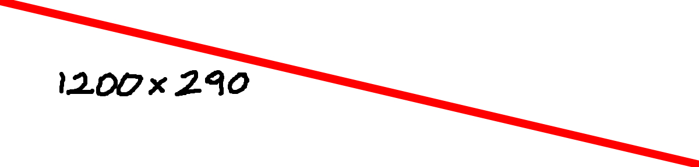

<table>
<tr valign="top">
<!-- LEFT COLUMN: LARGEST BLOCK (OCCUPIES THE MAXIMUM SPACE) -->
<td>

  <h1>
    Vinicius
  </h1>
    

      Description &nbsp;🇧🇷&nbsp;Brazil
     
      a
       
      b
       
      c
    

 
<!-- BANNER -->

  
<!-- DIVIDER -->
  

</td> 
<!-- RIGHT COLUMN: SMALLER BLOCK (STEAM STYLE, FIXED MAX-WIDTH) -->
<td width="300" style="max-width:300px;">
  

     
      $\Huge \textsf{Level }$
      $\Huge \textsf{\color{#f00d45}{⑱}}$

 
<!-- IDK IMAGE -->

        
<!-- PROFILE BUTTONS -->

    
    

 
 
<!-- PROFILE AWARDS -->

    $\Large \textsf{{Profile Awards }}$
    $\Huge \textsf{\color{#9b9b9b}{5}}$

    

      <!--
      
      
      
      
      
      -->
      
    

  

  
<!-- BADGES -->

    $\Large \textsf{Badges }$
    $\Huge \textsf{\color{#9b9b9b}{5}}$

   <!--
    
    
    
    
    
    -->
    

 
 
<!-- GAMES -->

  $\Large \textsf{Games }$
  $\Huge \textsf{\color{#9b9b9b}{8}}$
    

      <!--
      
      
      
      
      
      -->
      <a href="https://skillicons.dev">
      
       
      
      </a>
  

 
<!-- INVENTORY -->

  $\Large \textsf{Invetory }$
  $\Huge \textsf{\color{#9b9b9b}{96}}$

 
<!-- ARTWORK -->

  $\Large \textsf{Artwork }$
  $\Huge \textsf{\color{#9b9b9b}{79}}$

    
    <!--
      
      
      
      -->

 
</td>
</tr>
</table>

